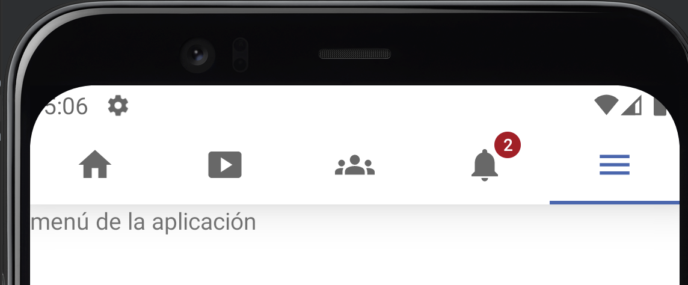

# Práctica - TabLayout

Replicar el tab de la aplicación de Facebook.

Pista: algunas cosas se pueden modificar en los **themes** de la app

Ayuda: https://github.com/material-components/material-components-android/blob/master/docs/components/Tabs.md

**Resultado**:

# android-ex-tabs-facebook
